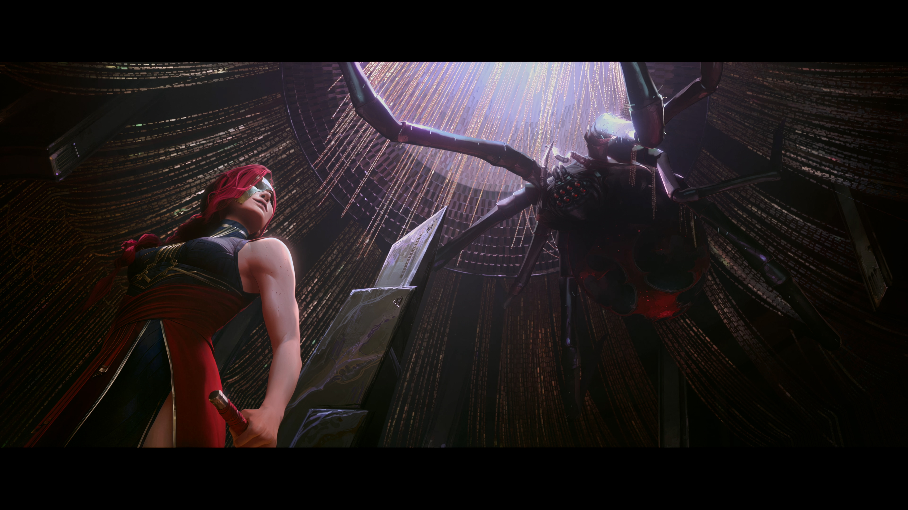
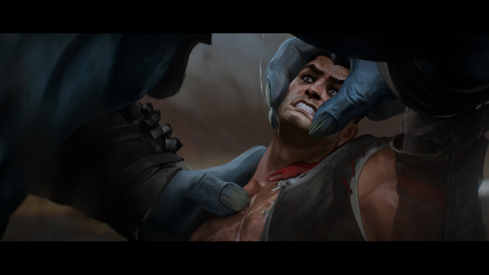
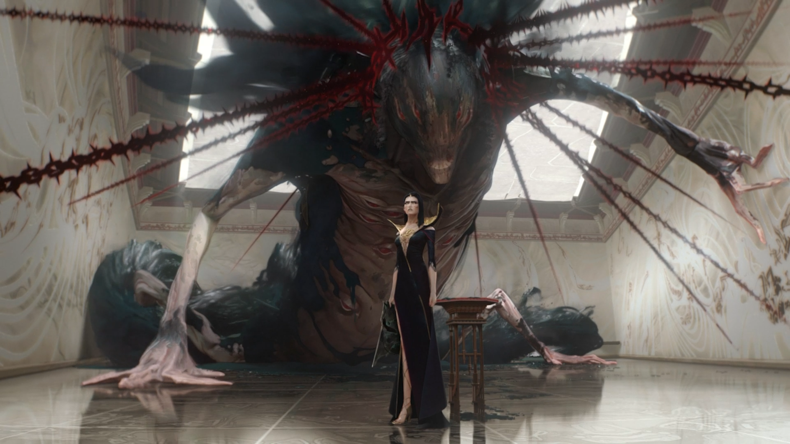

<h6 class="post-subtitle">Project Details</h6>

Across 2025 we wanted to take players on journey that began in Noxus and ended in the release of Zaahen. I worked as one of the primary architects of this year long story that took place in and around game. Additionally I the was lead on the four major cinematic story pieces. I co-wrote each piece and, alongside Fortiche, directed the four cinematics.

<iframe width="560" height="315" src="https://www.youtube.com/embed/I76wvt0aEE4?si=b72TJVNfFpdrYAhr" title="YouTube video player" frameborder="0" allow="accelerometer; autoplay; clipboard-write; encrypted-media; gyroscope; picture-in-picture; web-share" referrerpolicy="strict-origin-when-cross-origin" allowfullscreen></iframe>

<iframe width="560" height="315" src="https://www.youtube.com/embed/mSoGkTxu_FY?si=-3urJ8tSYBsceJPJ" title="YouTube video player" frameborder="0" allow="accelerometer; autoplay; clipboard-write; encrypted-media; gyroscope; picture-in-picture; web-share" referrerpolicy="strict-origin-when-cross-origin" allowfullscreen></iframe>

<iframe width="560" height="315" src="https://www.youtube.com/embed/Myx2AU_GxNU?si=SCzY2APNK1pQSY9h" title="YouTube video player" frameborder="0" allow="accelerometer; autoplay; clipboard-write; encrypted-media; gyroscope; picture-in-picture; web-share" referrerpolicy="strict-origin-when-cross-origin" allowfullscreen></iframe>

<iframe width="560" height="315" src="https://www.youtube.com/embed/bDMqoIq1kjo?si=Bp26rCQjxV3RHL4w" title="YouTube video player" frameborder="0" allow="accelerometer; autoplay; clipboard-write; encrypted-media; gyroscope; picture-in-picture; web-share" referrerpolicy="strict-origin-when-cross-origin" allowfullscreen></iframe>

<h6 class="post-subtitle">Project Details</h6>

I had the chance to speak at SDCC Malaga alongside some of my collaborators from Fortiche about this work.

<iframe width="560" height="315" src="https://www.youtube.com/embed/f9rlCruxuO4?si=7V1gmu_iUSAwTA23" title="YouTube video player" frameborder="0" allow="accelerometer; autoplay; clipboard-write; encrypted-media; gyroscope; picture-in-picture; web-share" referrerpolicy="strict-origin-when-cross-origin" allowfullscreen></iframe>

