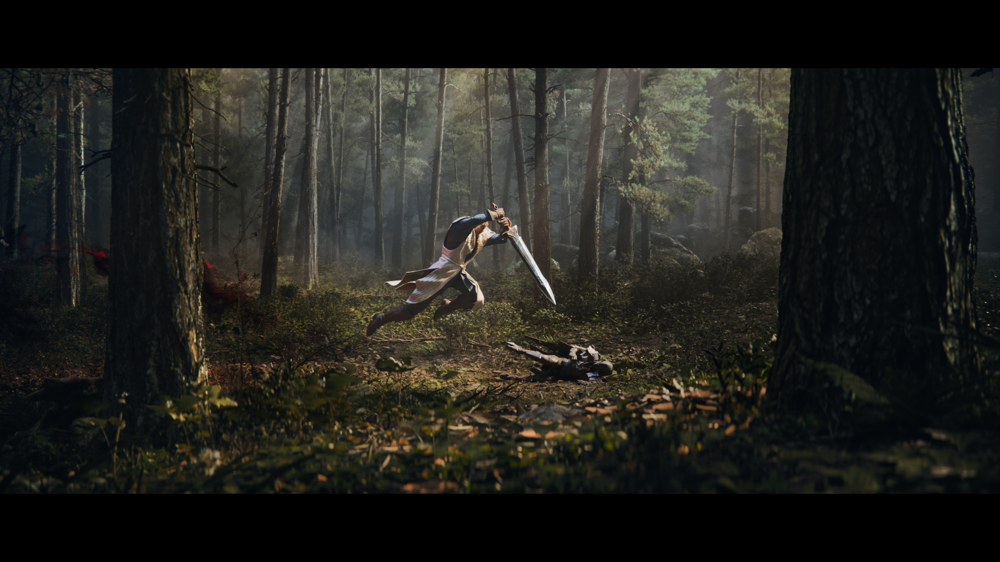
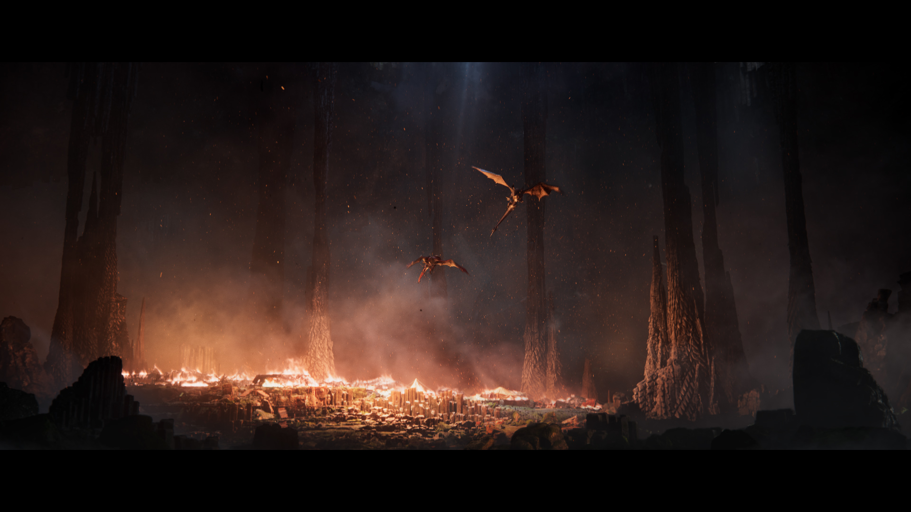
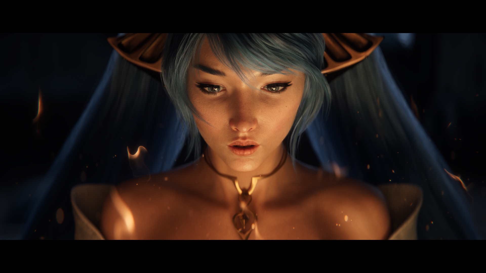
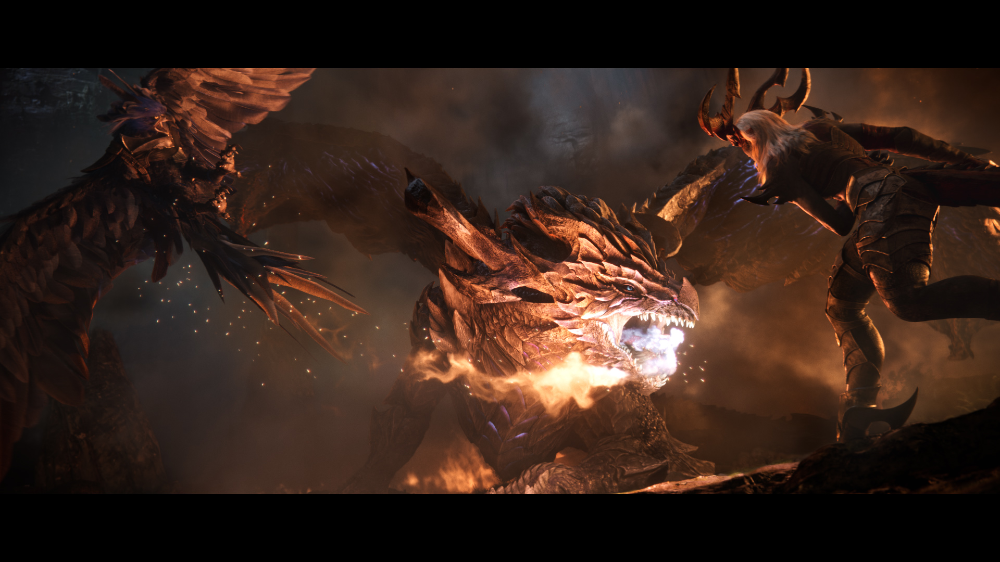
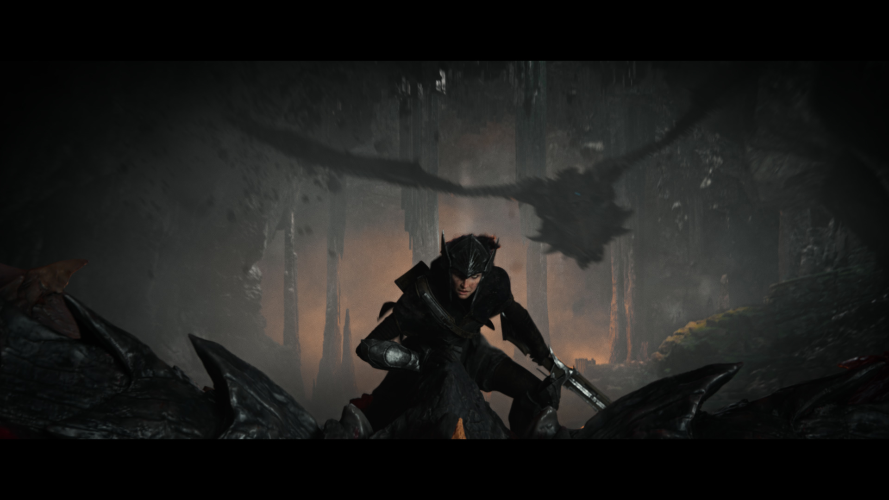
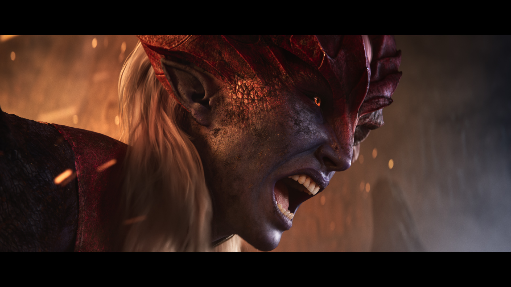
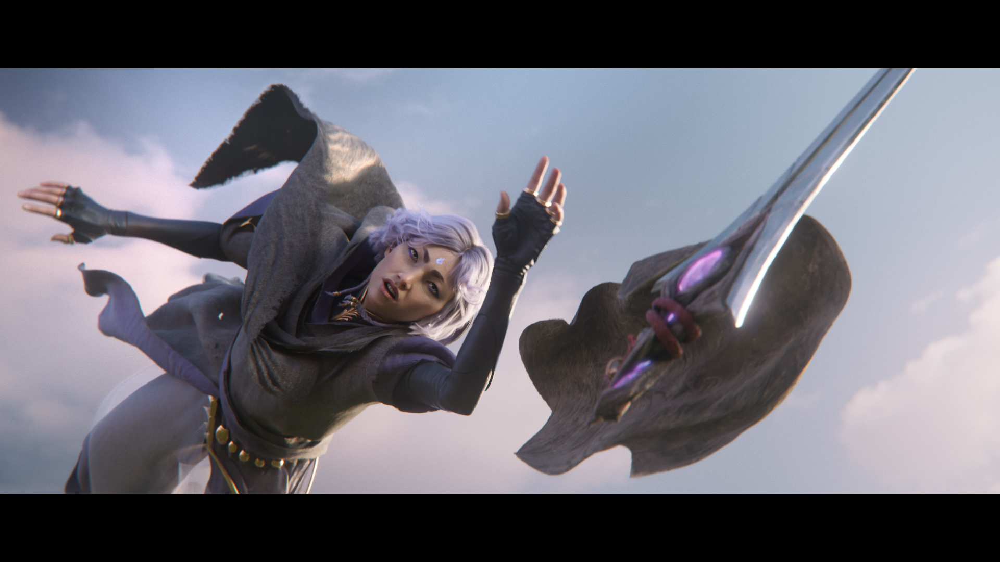

<iframe width="560" height="315" src="https://www.youtube.com/embed/e3D7Fj1PsWk?si=MV_qVaDYZuCUd1aV" title="YouTube video player" frameborder="0" allow="accelerometer; autoplay; clipboard-write; encrypted-media; gyroscope; picture-in-picture; web-share" referrerpolicy="strict-origin-when-cross-origin" allowfullscreen></iframe>

<h6 class="post-subtitle">Project Details</h6>
This Season Start cinematic was very nostalgic for me.  I grew up on stories of King Arthur and knights and shining armor.  In this we want to make it aspirational to be virtuous hero and show the dream of a place dedicated to protecting those who are willing to protect others from the magic and dangers of the world.  Demacia itself needed to be the overarching character that brought all the others together.  Everything builds towards the arrival at the capital city where all the individual stories ideals' live.

