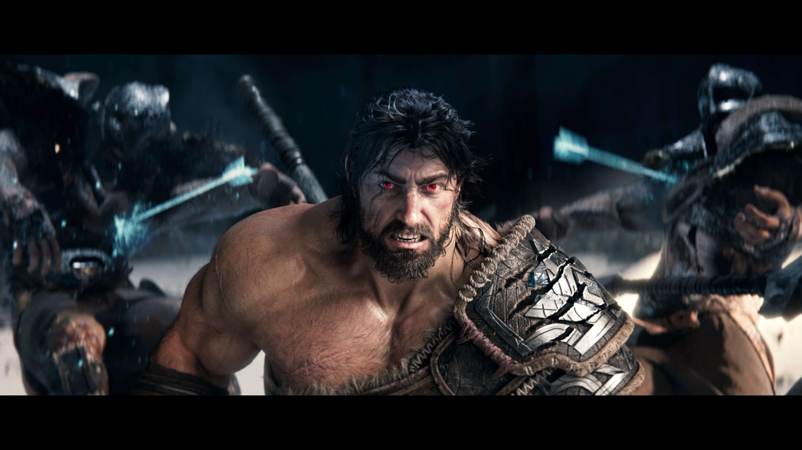

<iframe width="560" height="315" src="https://www.youtube.com/embed/ZHhqwBwmRkI?si=DhFxtZWCHDTWi2AF" title="YouTube video player" frameborder="0" allow="accelerometer; autoplay; clipboard-write; encrypted-media; gyroscope; picture-in-picture" allowfullscreen></iframe>

<h6 class="post-subtitle">Project Details</h6>
The season 2024 campaign was a crucial inflection point for League of Legends.  Players were let down by the events of 2023 in League of Legends and it was necessary to regain their trust and fandom.  We wanted to acknowledge these stakes and also make sure we were exceeding player expectations in this moment.  This all culminated in the Still Here cinematic.  Still Here was the first Riot cinematic to reach 100 million views.  It crossed that mark in 5 days while also amassing 1.7 million likes.

