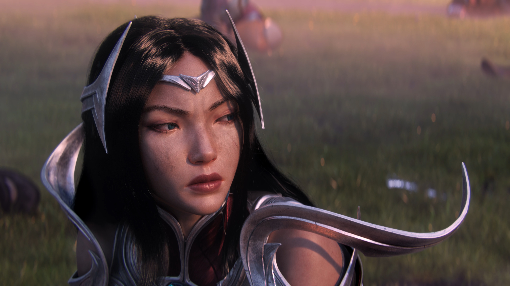
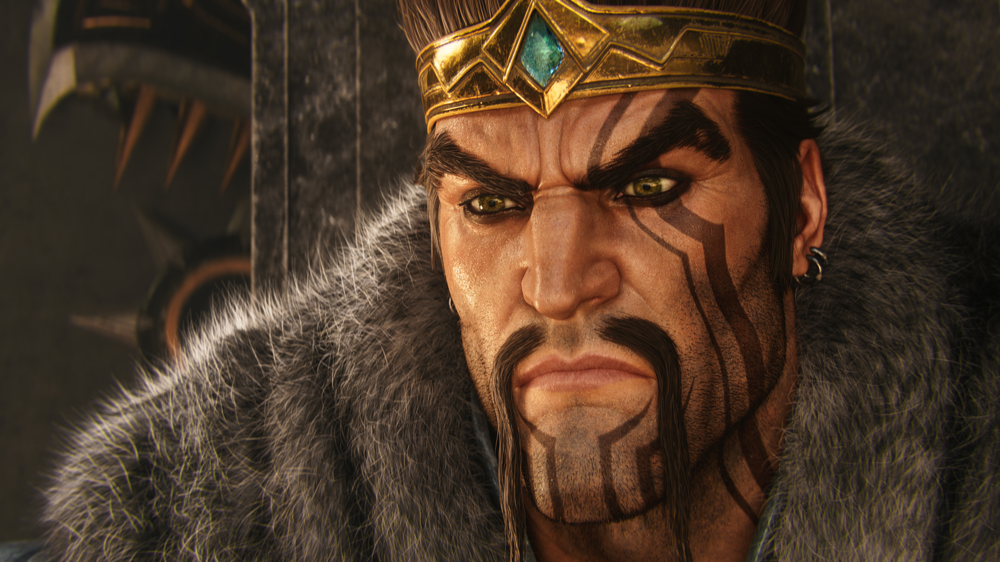
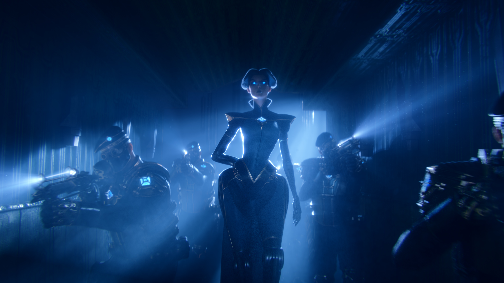
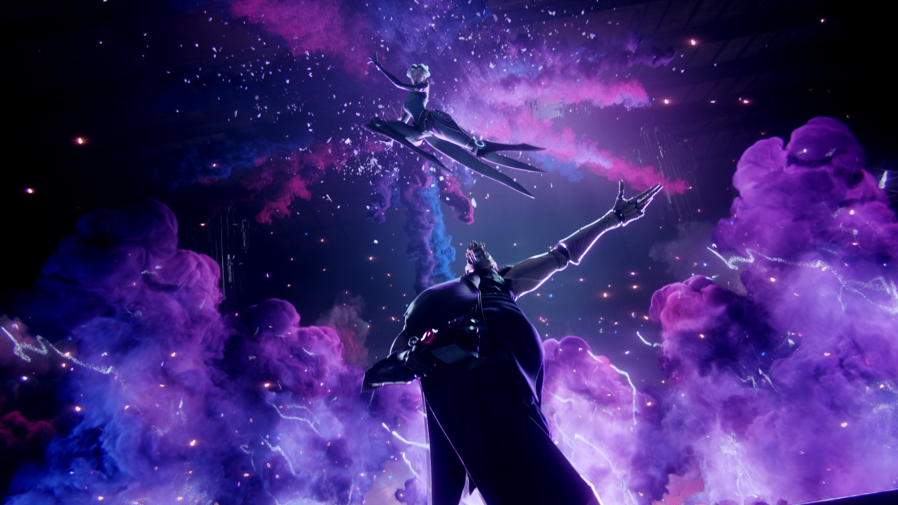
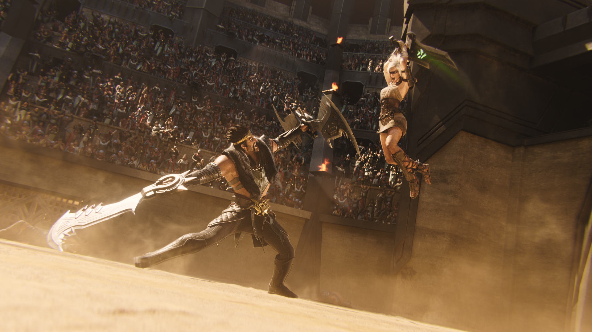

<iframe width="560" height="315" src="https://www.youtube.com/embed/zF5Ddo9JdpY?controls=0" title="YouTube video player" frameborder="0" allow="accelerometer; autoplay; clipboard-write; encrypted-media; gyroscope; picture-in-picture" allowfullscreen></iframe>

<h6 class="post-subtitle">Project Details</h6>
Awaken is a music driven story piece meant to evoke relatable player emotions through the stories of characters.  It was created as the marquee film for the marketing campaign to open the 2019 season of League of Legends.  In addition to what is seen on screen we wrote the stories that come before and after these moments in order to achieve more realistic depths to the characters and their performances.

