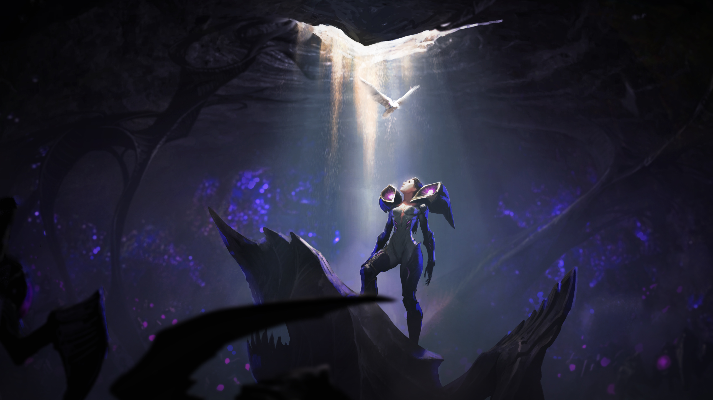

<!-- [Read the comic](https://na.leagueoflegends.com/en/featured/kaisa-comic) -->

  <a href="https://na.leagueoflegends.com/en/featured/kaisa-comic" class="button primary large">Read the Comic</a>

Before down scoping this project, we developed a cinematic trailer to introduce Kai'sa's character.  Read the script here.

Concept Art by Jason Chan
