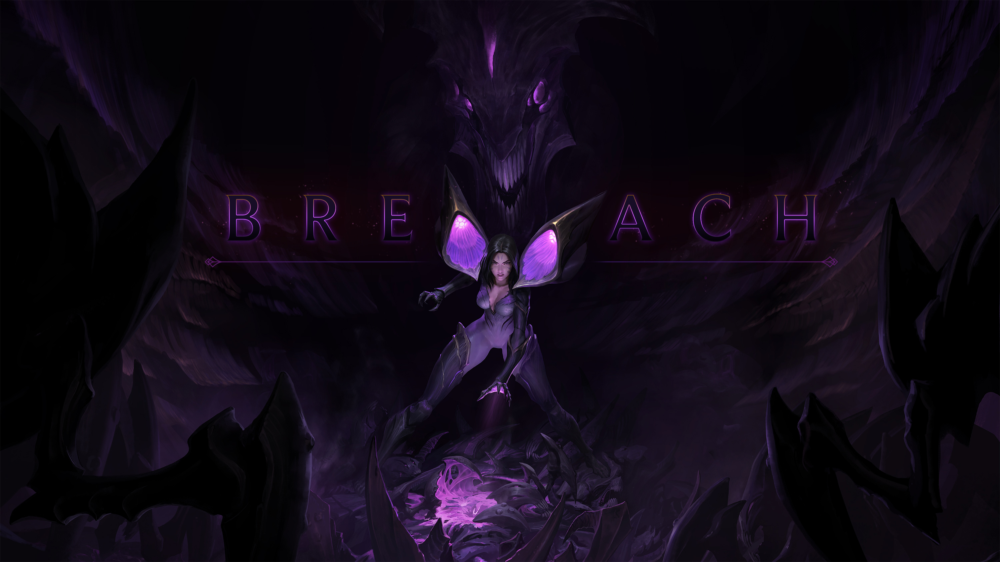
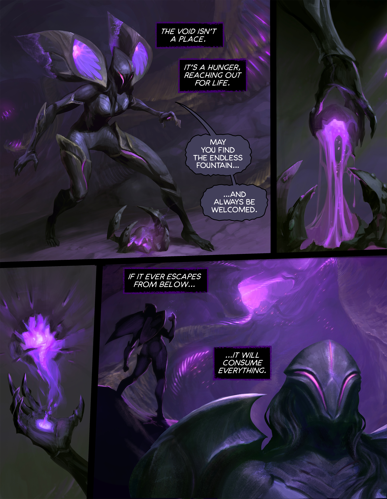
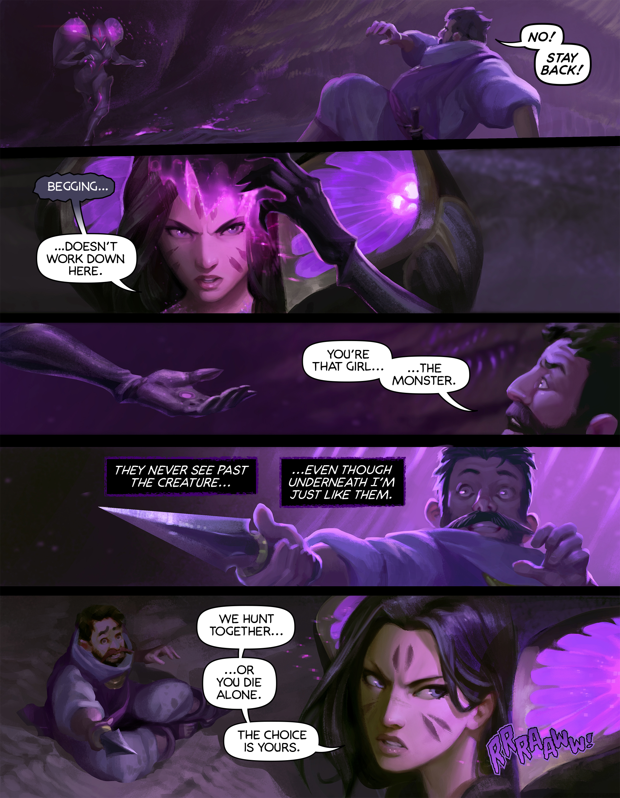
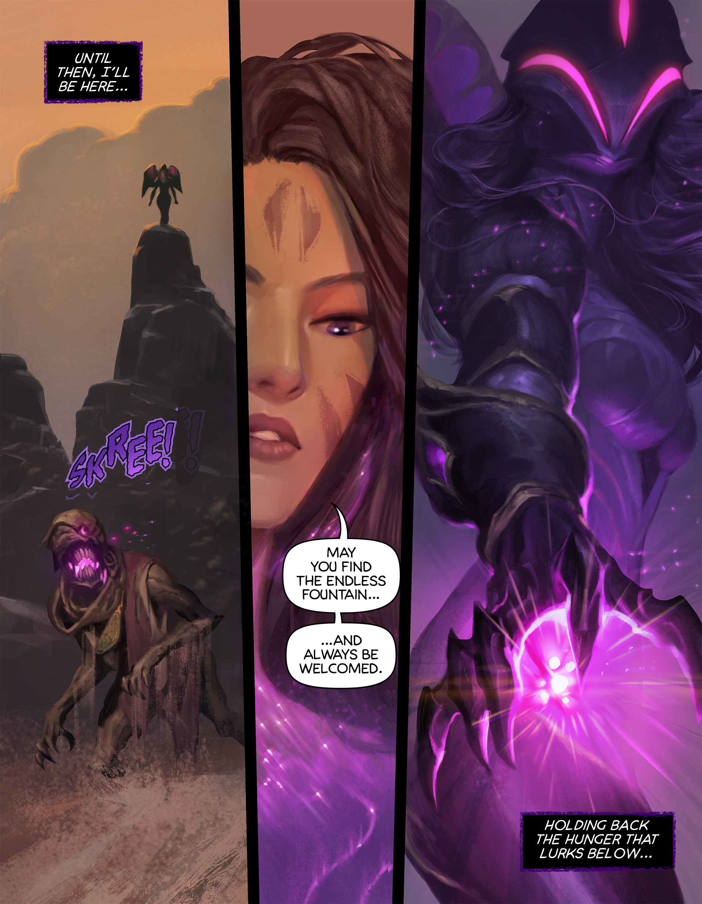

<!-- [Read the comic](https://na.leagueoflegends.com/en/featured/kaisa-comic) -->

  <a href="https://na.leagueoflegends.com/en/featured/kaisa-comic" class="button primary large">Read the Full Comic</a>

Creative Direction and Story by Matt Costa

Art by Elena Bespelova

Layouts by Dan Norton

Written and Story by Phillip Vargas

