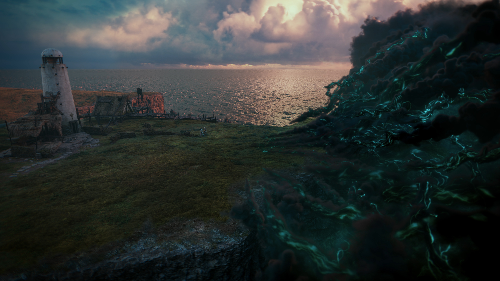
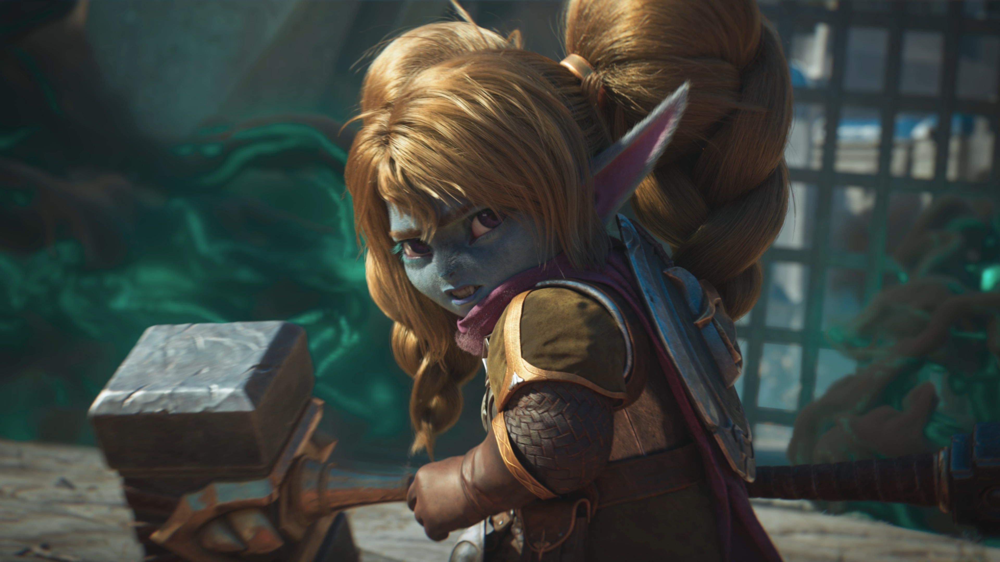

<iframe width="560" height="315" src="https://www.youtube.com/embed/8PbhGt8XxSM?controls=0" title="YouTube video player" frameborder="0" allow="accelerometer; autoplay; clipboard-write; encrypted-media; gyroscope; picture-in-picture" allowfullscreen></iframe>

<h6 class="post-subtitle">Project Details</h6>
Shadow’s Embrace purposefully left a lot of questions for players about the future for Senna and Lucian after being reunited.  The popularity of their story gave us an opportunity to revisit it and show how the consequences of their story would affect the stories of other champions throughout the world.  We did that in Ruination to kick off the 2021 Season of LoL and set up future storytelling throughout the year.

