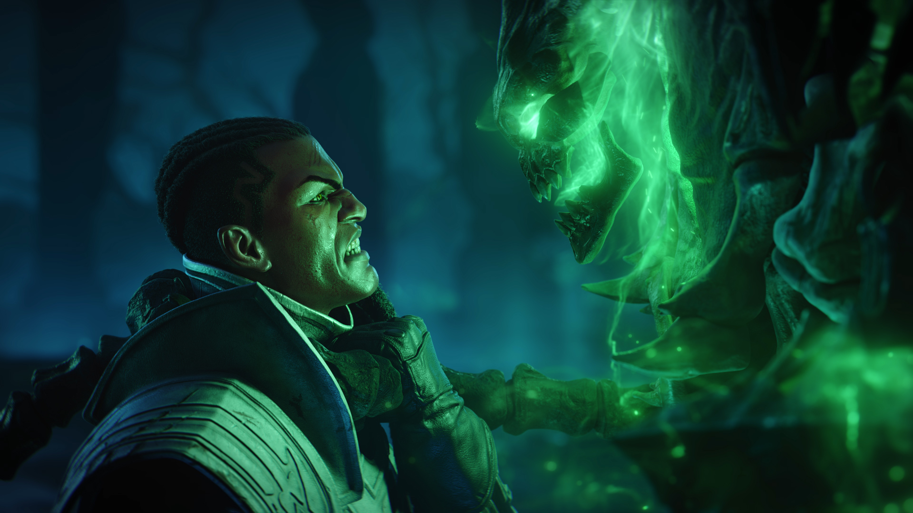

<h6 class="post-subtitle">Project Details</h6>

The Senna story was an opportunity to move one of our most well established character arcs forward with the release of Lucian’s wife, Senna. This was a larger more story focused campaign than we would typically do for a single champion release, but it was something I pushed for as I knew the return of Lucian's wife was an important moment for players to experience alongside Lucian. I was creative director for the overall story campaign and co-wrote/director for the animated portions.

**Part 1:** [Homebound](https://universe.leagueoflegends.com/en_US/story/homebound/) by Phillip Vargas

**Part 2:** Dark Passage

<iframe width="560" height="315" src="https://www.youtube.com/embed/BWjbBlvf9cw?controls=0" title="YouTube video player" frameborder="0" allow="accelerometer; autoplay; clipboard-write; encrypted-media; gyroscope; picture-in-picture" allowfullscreen></iframe>

---

**Part 3:** Shadow's Embrace

<iframe width="560" height="315" src="https://www.youtube.com/embed/ZjvDFvzfxsQ?controls=0" title="YouTube video player" frameborder="0" allow="accelerometer; autoplay; clipboard-write; encrypted-media; gyroscope; picture-in-picture" allowfullscreen></iframe>

