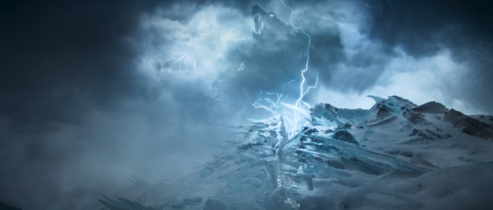

<iframe width="560" height="315" src="https://www.youtube.com/embed/mDYqT0_9VR4?controls=0" title="YouTube video player" frameborder="0" allow="accelerometer; autoplay; clipboard-write; encrypted-media; gyroscope; picture-in-picture" allowfullscreen></iframe>

<h6 class="post-subtitle">Project Details</h6>
The Call is a music driven story piece.  It is in the style of Season cinematics that I had developed with the team when working on Awaken.  In order to differentiate this piece from previous ones, I wanted to tell stories about champions taking on forces beyond their control and understanding.  To do this we put them into situations where they would need to confront higher powers and manifestations of the world around them.  This also gave us the opportunity to achieve another goal, which was making the world around these champions feel bigger and in some ways more mysterious.

This cinematic was created as the marquee film for the Season 2022 marketing campaign. In addition to the cinematic, I also worked with the narrative team to have stories written that expanded the moment and add depth to the events on screen.

